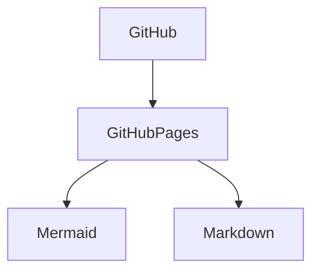

# Welcome

**Hello world**, this is my first blog post as I sort through Jekyll now that I have mermaid working.

```mermaid
  graph TD;
      GitHub-->GitHubPages;
      GitHubPages-->Mermaid;
      GitHubPages-->Markdown;
```