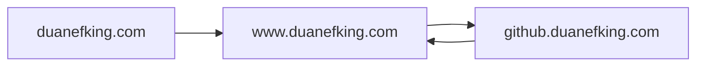

# About

This is a Github pages powered git repo that uses a hacker theme with some modifications to enable some extra features.  I intentionally do not run a local Jekyll instance, or worry about the Ruby side of things; I use the GH Pages deploy as CI/CD, and thats what is fun for me.

It started out with me just wanting to get MermaidJS working, because it didn't by default. And then after I got that working, I got bored because I had solved the problem so it sat.

I will add to this as problems interesting enough to warrant being solved present themselves.

Until then a picture is worth a thousand words; Here is a flowchart I wrote in text using MermaidJS:

